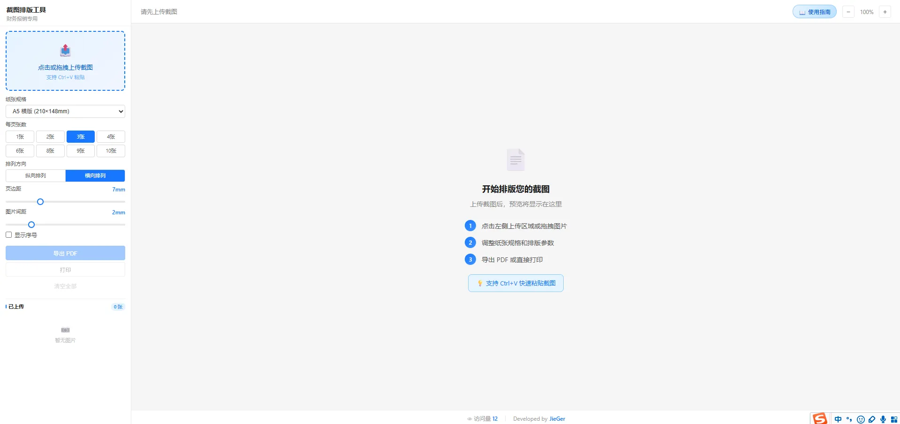
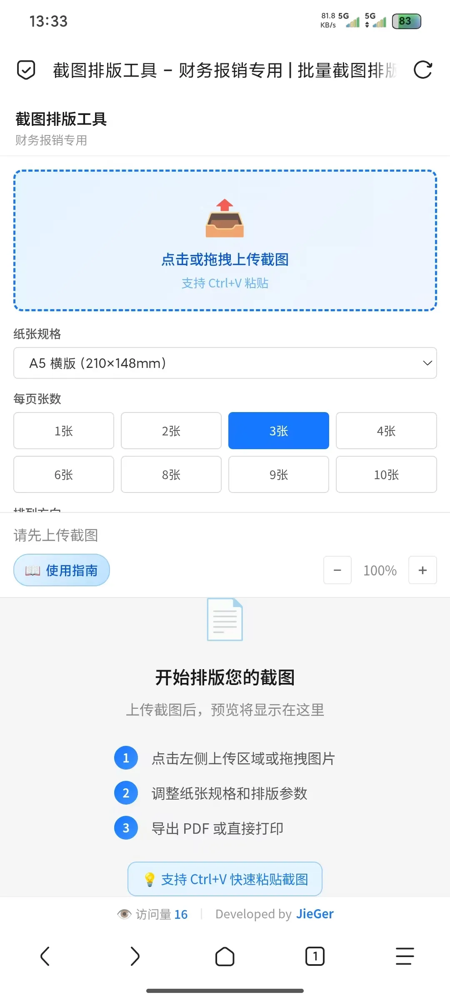

# 截图排版工具

> 🌐 **在线体验**: [https://dy.mamkj.top/](https://dy.mamkj.top/)

面向财务报销场景的轻量级网页工具，将手机截图批量排版到指定纸张，支持导出 PDF 和打印。

---

## 界面预览

### 电脑端



### 手机端



---

## 功能特性

### 图片上传
- **多种上传方式**：点击上传、拖拽上传、Ctrl+V 粘贴上传
- **批量上传**：支持一次选择/粘贴多张图片
- **格式支持**：JPG、PNG、WebP 等常见图片格式

### 排版设置
| 设置项 | 选项/范围 | 默认值 |
|--------|----------|--------|
| 纸张规格 | A5横版、A5竖版、A4横版、A4竖版、**自定义尺寸** | A5横版 |
| 每页张数 | 1、2、3、4、6、8、9、**10** 张 | 3张 |
| 排列方向 | 纵向排列、横向排列 | 横向排列 |
| 页边距 | 2-20mm | 7mm |
| 图片间距 | 0-10mm | 2mm |
| 显示序号 | 开/关 | 关 |

### 自定义纸张
- 支持输入自定义宽高（50mm ~ 500mm）
- 实时预览自定义尺寸效果
- 自动缩放适应预览容器

### 图片管理
- **拖拽排序**：支持拖动调整图片顺序
- **实时预览**：设置变更后自动重新排版
- **缩放控制**：30%-200% 缩放预览，Ctrl+滚轮缩放
- **单张删除**：点击删除按钮移除单张图片
- **全部清空**：一键清空所有已上传图片

### 导出与打印
- **导出 PDF**：确认排版信息后导出 PDF 文件
- **打印功能**：打开浏览器打印预览，支持打印设置提示
- **进度显示**：导出时显示进度条
- **结果提示**：成功/失败 Toast 提示

---

## 排版规则

### 每页张数布局

| 每页张数 | 纵向排列 | 横向排列 |
|---------|---------|---------|
| 1张 | 1×1 | 1×1 |
| 2张 | 2行×1列 | 1行×2列 |
| 3张 | 3行×1列 | 1行×3列 |
| 4张 | 2行×2列 | 2行×2列 |
| 6张 | 3行×2列 | 2行×3列 |
| 8张 | 4行×2列 | 2行×4列 |
| 9张 | 3行×3列 | 3行×3列 |
| 10张 | 5行×2列 | 2行×5列 |

### 排列顺序
- **纵向排列**：先从上到下填满第一列，再填第二列
- **横向排列**：先从左到右填满第一行，再填第二行

### 图片缩放
每张图片按比例缩放，完整显示在格子中，不裁切，居中排列。

---

## 项目结构

```
screenshot-layout/
├── index.html          # 主页面
├── css/
│   └── style.css       # 样式表
├── js/
│   └── app.js          # 主脚本
├── assets/
│   ├── favicon.jpg     # Logo图标
│   ├── desktop-preview.webp  # 电脑端截图
│   └── mobile-preview.webp    # 手机端截图
└── README.md           # 本文档
```

---

## 部署说明

### 本地使用
直接双击 `index.html` 用浏览器打开即可使用。

### Cloudflare Pages 部署
1. 将项目推送到 GitHub 仓库
2. 在 Cloudflare Pages 中连接仓库
3. 构建输出目录设置为 `.`
4. 点击部署，几分钟后即可在线访问

### 其他部署方式
- **Vercel / Netlify**：类似配置，直接托管静态文件
- **Nginx / Apache**：放到网站根目录即可
- **对象存储**：上传到 OSS/COS，开启静态网站托管

---

## 技术栈

- **前端**：原生 HTML5 + CSS3 + JavaScript（ES6+）
- **PDF 导出**：jsPDF（CDN 引入）
- **访问统计**：不蒜子（busuanzi）
- **部署**：纯静态页面，支持 Cloudflare Pages、Vercel、Netlify 等

---

## 版本历史

| 版本 | 日期 | 说明 |
|------|------|------|
| v1.3.0 | 2026-06-24 | 新增自定义纸张尺寸、图片拖拽排序、每页10张选项、访问量统计 |
| v1.2.0 | 2026-06-24 | 新增移动端响应式适配、打印设置提示弹窗 |
| v1.1.0 | 2026-06-23 | 优化排版逻辑，新增每页张数选项；UI 简约化；增加确认对话框 |
| v1.0.0 | 2026-06-23 | 网页版初版发布，支持基础排版、PDF导出、打印功能 |

---

## License

MIT License